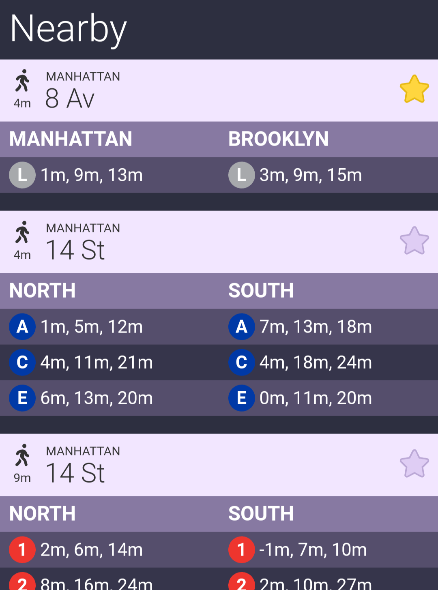

# Midnight Train

Midnight Train is an experiment in showing the NYC subway's real time arrival data in a super fast, dense, commuter-centric format. There are lots of apps and services for help with navigation and wayfinding. Midnight Train is for a day to day rider who knows where they're going and wants one-tap answers to questions like:

* Is the L train running normally? (real time arrival data typically offers a quick answer to that question without having to read and understand complex service announcements).
* Should I walk three minutes farther to take a G?
* Should I take the J that's coming now or wait for the next M?
* Do I need to message my boss to tell them I'll be a few minutes late?

It's a work in progress for now, but the basic functionality I want from it is there.

All data comes from the MTA's static and real time APIs. Thanks to them for making these APIs widely available to hobbyists like me, and for providing excellent documentation.

Route symbols ™ Metropolitan Transit Authority. Used with permission.

This is not an official Google product.
